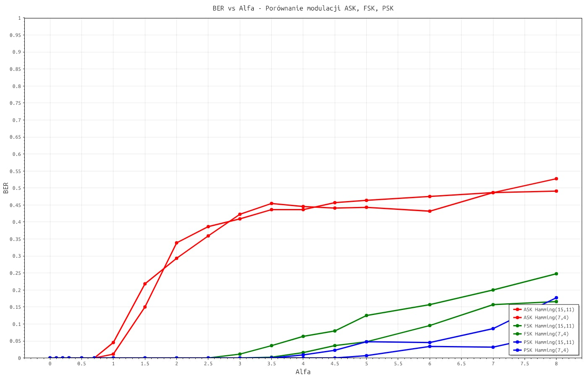
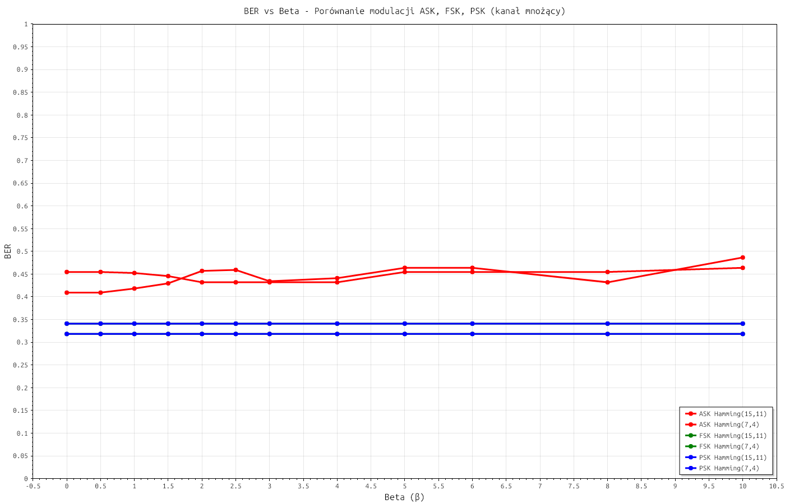

# Projekt: Model transmisji danych

## Opis projektu

Projekt przedstawia kompletny model transmisji danych, który obejmuje:

- Kodowanie i dekodowanie za pomocą kodów Hamminga (7,4) oraz (15,11)
- Modulację i demodulację sygnału z wykorzystaniem:
  - ASK (Amplitude Shift Keying)
  - PSK (Phase Shift Keying)
  - FSK (Frequency Shift Keying)
- Symulację kanału transmisyjnego uwzględniającego:
  - Szum (np. szum Gaussowski)
  - Tłumienie sygnału

Celem projektu jest analiza skuteczności transmisji dla różnych metod modulacji oraz kodowania z korekcją błędów.

---

## Struktura modelu transmisyjnego

Model zawiera następujące etapy:
1. **Źródło danych** – generowanie danych binarnych
2. **Kodowanie Hamminga** – zabezpieczenie danych przed błędami
3. **Modulacja** – odwzorowanie danych na sygnał analogowy
4. **Kanał transmisyjny** – zakłócenia: szum i tłumienie
5. **Demodulacja** – odzyskanie danych binarnych z sygnału
6. **Dekodowanie Hamminga** – korekcja błędów
7. **Obliczenie BER** – wskaźnik poprawności transmisji

---

## Kodowanie Hamminga

Zaimplementowano dwa warianty kodu Hamminga:
- **Hamming(7,4)**: 4 bity informacji → 7 bitów kodu
- **Hamming(15,11)**: 11 bitów informacji → 15 bitów kodu

---

## Modulacje

Model wspiera następujące typy modulacji:

| Modulacja | Opis |
|-----------|------|
| ASK       | Modulacja amplitudy |
| PSK       | Modulacja fazy       |
| FSK       | Modulacja częstotliwości |

---

## Kanał transmisyjny

Kanał zakłada obecność:
- Szumu (np. biały szum Gaussowski)
- Tłumienia sygnału (modelowane współczynnikiem osłabienia amplitudy)

---

## Wyniki eksperymentów

Wyniki zaprezentowano na wykresach zależności BER (Bit Error Rate) od parametrów szumu.

### BER dla scenariusza Alfa

### BER dla scenariusza Beta

---
